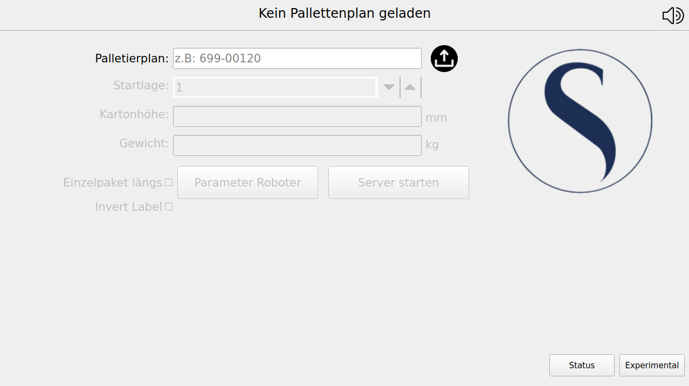

<div align="center">
  
  
  <h1>🤖 MultipackParser</h1>
  
  <p><strong>Bridge software connecting Multipack optimization software with Universal Robots palletizing systems</strong></p>

  <a href="https://github.com/Snupai/MultipackParser/actions/workflows/build.yml">
    
  </a>
  <a href="https://github.com/Snupai/MultipackParser/releases/latest">
    
  </a>
  <a href="https://github.com/Snupai/MultipackParser/blob/main/LICENSE">
    
  </a>
  
  
</div>

---

## Overview

MultipackParser is a bridge application that connects **[Multipack](https://multiscience.de/multipack-ihre-optimierungssoftware/)** (commercial palette optimization software from Multiscience GmbH) with custom palletizing applications running on Universal Robots (UR10/UR20).

### How It Works

```
┌─────────────────┐      ┌──────────────────┐      ┌─────────────────┐
│   Multipack     │ ───► │  MultipackParser │ ───► │   UR Robot      │
│ (Optimization)  │ CSV  │   (This App)     │ RPC  │ (Palletizing)   │
└─────────────────┘      └──────────────────┘      └─────────────────┘
```

1. **Multipack** generates optimized palette plans (`.rob` files) based on box/palette dimensions
2. **MultipackParser** reads and parses these files, providing a GUI for management
3. **UR Robot** queries palette data via XML-RPC to execute the palletizing program

### Key Features

| Feature | Description |
|---------|-------------|
| 📦 **Pallet Management** | Load, visualize, and manage pallet configurations with 3D preview |
| 🤖 **Robot Communication** | Real-time XML-RPC communication with UR10/UR20 robots |
| 🗄️ **Database Storage** | SQLite database for persistent pallet data storage |
| 📊 **Status Monitoring** | Live monitoring of robot mode, safety status, and scanners |
| 🔒 **Security** | Password-protected settings and operations |
| 🔊 **Audio Feedback** | Configurable audio notifications for system events |

## Quick Start

### Requirements

- Python 3.12+
- Linux (optimized for Raspberry Pi)
- [Multipack software](https://multiscience.de/multipack-ihre-optimierungssoftware/) for generating palette plans

### Installation

```bash
# Clone the repository
curl -O https://github.com/Snupai/MultipackParser/releases/latest/MultipackParser 

# Make binary executable
sudo chmod +x MultipackParser

# Run the application
./MultipackParser
```

### Command Line Options

```bash
./MultipackParser --version    # Display version
./MultipackParser --license    # Display license
./MultipackParser --verbose    # Enable debug logging
./MultipackParser --no-virtual-keyboard # Disables the virutal keyboard
```

> [!IMPORTANT]
> **Robot-Side Components Required**: This application requires a UR Program and URscript code running on the Universal Robot controller. These components are **not included** in this repository and must be obtained separately.

## Documentation

Comprehensive documentation is available in the [`docs/`](docs/) directory:

| Document | Description |
|----------|-------------|
| [**Documentation Index**](docs/index.md) | Overview and navigation hub |
| [**Installation Guide**](docs/installation.md) | Detailed setup instructions |
| [**User Guide**](docs/user-guide.md) | Complete user manual |
| [**Architecture**](docs/architecture.md) | Technical documentation for developers |
| [**API Reference**](docs/api-reference.md) | XML-RPC API function reference |

## Development

### Prerequisites

- Python 3.13+
- pip / uv package manager
- Qt Designer (optional, for UI modifications)
- Docker (optional, for ARM64 builds)

### Setting Up Development Environment

```bash
# Clone and install
git clone https://github.com/Snupai/MultipackParser.git
cd MultipackParser
pip install -r requirements.txt

# Run in development mode
python main.py --verbose
```

### UI Development

```bash
# Open Qt Designer for UI editing
pyside6-designer ui_files/MainWindow.ui

# Convert .ui files to Python
pyside6-uic ui_files/MainWindow.ui -o ui_files/ui_main_window.py

# Convert resource files
pyside6-rcc ui_files/MainWindowResources.qrc -o ui_files/MainWindowResources_rc.py
```

> [!WARNING]
> After running `pyside6-uic`, change the import from `import MainWindowResources_rc` to `from . import MainWindowResources_rc`

### Building for Production

```bash
# Build ARM64 binary (requires Docker)
python build.py
```

The resulting binary will be placed in the `local_dist` directory. The binary is compatible with ARM64 architecture (Raspberry Pi).

## Project Structure

```
MultipackParser/
├── main.py                 # Application entry point
├── build.py               # Build script for ARM64 binary
├── requirements.txt       # Python dependencies
├── ui_files/              # Qt UI files and resources
├── utils/                 # Core application modules
│   ├── audio/            # Audio notifications
│   ├── database/         # SQLite database operations
│   ├── message/          # Message and status management
│   ├── robot/            # Robot control and monitoring
│   ├── server/           # XML-RPC server implementation
│   ├── system/           # Core system utilities
│   └── ui/               # UI setup and helpers
├── docs/                  # Documentation
└── logs/                  # Application logs (auto-generated)
```

## System Requirements

| Component | Requirement |
|-----------|-------------|
| Python | 3.12 or higher |
| OS | Linux (Raspberry Pi) |
| RAM | 512MB minimum, 1GB recommended |
| Storage | 300MB free space |
| Robot | Universal Robots UR10 or UR20 |

## License

This project is licensed under the **GNU General Public License v3.0**. See the [LICENSE](LICENSE) file for details.

```
Copyright (C) 2025 Yann-Luca Näher

This program is free software: you can redistribute it and/or modify
it under the terms of the GNU General Public License as published by
the Free Software Foundation, either version 3 of the License, or
(at your option) any later version.
```

## Contributing

Contributions are welcome! Please read the [Architecture Documentation](docs/architecture.md) to understand the codebase structure before submitting pull requests.

---

<div align="center">
  <sub>Built with ❤️ for industrial automation</sub>
</div>
